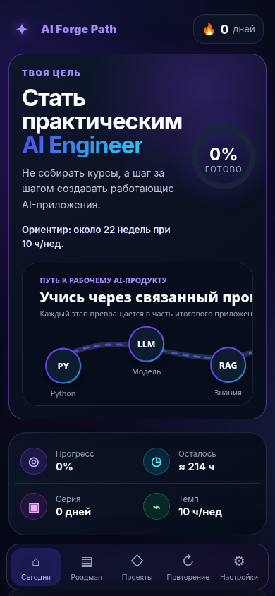

# AI Forge Path

**AI Forge Path** — визуальное PWA-приложение для практического обучения профессии AI Engineer. Оно превращает большой roadmap в короткие ежедневные шаги, наглядные схемы и портфолио-проекты.



## Что внутри

- 11 этапов и 55 учебных тем;
- постоянный тёмный интерфейс;
- 14 локальных SVG-инфографик без внешних сервисов;
- режим обучения «по порядку» и ускоренный режим «через проекты»;
- персональный план на день: понять → сделать руками → закрепить;
- фокус-таймер;
- заметки и мини-тесты;
- 6 проектов для портфолио;
- локальное хранение, экспорт и импорт прогресса;
- офлайн-работа и установка на главный экран;
- автоматическая публикация через GitHub Pages.

## Учебный маршрут

Python → библиотеки → основы AI → Prompt Engineering → LLM → RAG → AI Agents → фреймворки → Backend → деплой → проекты.

## Локальный запуск

PWA нельзя корректно тестировать двойным кликом по `index.html`. Запусти локальный сервер из корня проекта:

```bash
python -m http.server 8080
```

Открой `http://localhost:8080`.

## Установка на телефон

После публикации на HTTPS:

- **iPhone / Safari:** «Поделиться» → «На экран Домой»;
- **Android / Chrome:** меню браузера → «Установить приложение».

## GitHub Pages

В репозитории подготовлен workflow `.github/workflows/pages.yml`. В настройках репозитория открой **Settings → Pages** и укажи источник **GitHub Actions**. После push в `main` приложение опубликуется автоматически.

## Данные и приватность

Регистрация и сервер не используются. Прогресс, заметки и настройки хранятся в `localStorage` текущего браузера. Для переноса на другое устройство есть экспорт и импорт JSON.

## Структура

```text
.
├── index.html
├── styles.css
├── app.js
├── manifest.json
├── sw.js
├── icons/
├── assets/infographics/
├── assets/screenshots/
└── .github/workflows/pages.yml
```

## Лицензия

MIT.
